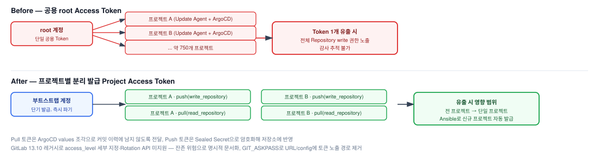

# GitLab Project Access Token 기반 인증 재설계

## 1. 배경

### 가. 현행 업데이트 구조
1) 각 고객사 서비스 업데이트 실행 시 사용되는 git 자격증명이 모두 동일한 단일 root token이며, 이 토큰을 전 고객사 프로젝트가 공유

### 나. 한계점
1) 단일 root token 하나가 전 고객사 프로젝트에 대한 write 권한을 보유. 토큰 1건 유출·만료 시 단일 장애점(SPOF)으로 작동
2) 필요 이상의 권한(git pull & push)이 상시 노출
3) 모든 push가 동일한 root 계정으로 기록되어, 이상 접근을 탐지해도 대상·폐기 범위 산정이 어려움
4) Token 값이 평문으로 설정 파일 및 프로젝트 config 파일에 노출

## 2. 기대효과

### 가. 보안 격리
1) **피해 범위 최소화**: 토큰 1건 유출 시 영향 범위를 전 프로젝트 → 1개 프로젝트로 축소, 해당 프로젝트 토큰만 즉시 폐기·재발급
2) **권한 최소화**: 권한을 `write_repository`(push) / `read_repository`(pull)로 한정, 관리 API·타 프로젝트 접근 권한 제거
3) **노출 경로 정리**: k8s secret 이전 및 git 인증정보 로컬 디스크 미저장으로 평문 자격증명 노출 경로 축소

### 나. 운영 추적성
1) **감사 가능성**: 프로젝트-토큰 1:1 매핑으로 push 주체 구분

### 다. 자동화 일관성
1) **발급 표준화**: 설치 시 Ansible을 통한 PAT 자동발급으로 수동 발급·전달 오류 제거
2) **재실행 안정성**: 토큰 존재 시 중복 발급 제거(멱등성 보장)
3) **권한 분리**: 발급 주체(Ansible)와 사용 주체(Update Agent, ArgoCD)를 분리해 발급 권한이 사용 주체에 없도록 설정

### 라. AS-IS / TO-BE 비교

| 항목 | AS-IS | TO-BE |
|---|---|---|
| 토큰 유효 범위 (유출·만료 시 영향 범위) | 전 프로젝트 | 단일 프로젝트 |
| 권한 수준 | root 권한 (전 프로젝트 write 및 GitLab 관리 API 호출) | 단일 프로젝트 한정 (단일 프로젝트 write) |
| 토큰 노출 경로 | 설정 파일 내 평문 (k8s configmap + `.git/config`) | 설정파일 평문 저장 제거 (k8s secret + git askpass) |
| 감사 추적 | 프로젝트 구분 불가 (push 주체: administrator) | 프로젝트-토큰 1:1 매핑 (push 주체: 프로젝트 bot) |

## 3. 변경 구성도 (Topology)



### 가. AS-IS

```
단일 ROOT TOKEN (1개) — 전 프로젝트 공용, scope: 전역 / 만료: 공용
             │
             ├── push ──▶ 고객사 A Update Agent
             ├── push ──▶ 고객사 B Update Agent
             ├── push ──▶ 고객사 C Update Agent
             ├── push ──▶ 고객사 D Update Agent
             └── push ──▶ ... N
                              │
                              ▼
        GitLab (그룹) — 전 프로젝트 write 가능
                              ▲
                              │ pull (동일 root 자격증명)
                         ArgoCD ── sync ──▶ CD
```

### 나. TO-BE

```
Ansible 컨트롤 노드 + 부트스트랩 토큰
  (상위 토큰: 발급 전용, 그룹 Maintainer/Owner, api scope — 구축/재발급 시점에만 주입)
             │
             │  POST /projects/:id/access_tokens
             │  (파일 미경유 — 메모리 → Secret 직접 생성)
             ▼
K8s Secret (RBAC 최소화, 프로젝트별 push PAT 개별 발급)
             │  GIT_ASKPASS 국소 주입 (URL·config·로그·argv에 토큰 미기록)
             ├── push ──▶ 고객사 A Update Agent ──▶ project A (해당 프로젝트만 접근)
             ├── push ──▶ 고객사 B Update Agent ──▶ project B (해당 프로젝트만 접근)
             └── push ──▶ 고객사 C Update Agent ──▶ project C (해당 프로젝트만 접근)
                                                        ▲
                                                        │ pull: per-repo credential
                                                        │ (프로젝트별 read 전용 토큰)
                                                   ArgoCD ── sync ──▶ CD
```

## 4. Token 명세 및 발급 흐름

### 가. Token 명세

| 항목 | 내용 |
|---|---|
| 용도별 권한 수준 | git push(Update Agent): `write_repository` / git pull(ArgoCD): `read_repository` / git API(부트스트랩): `api` |
| 명명 규칙 | push: `ansible-managed-token-push-<고객코드>` / pull: `ansible-managed-token-pull-<고객코드>` |
| 중복 판정 기준 | token id + active 상태 |
| 발급 주체 | 프로젝트 그룹 Maintainer 권한을 가진 전용 부트스트랩 계정 |

### 나. 발급 흐름

```
START
  │
  ▼
STEP 1  git 프로젝트 존재 확인
          ├─ N → 생성 파이프라인 트리거 → success 폴링 대기 → 프로젝트 ID 확보
          └─ Y → (바로 다음 단계로)
  │
  ▼
STEP 2  토큰 목록 1회 조회 (id / active 보존)
  │
  ▼
STEP 3  용도별 루프 (push / pull)
  │
  ▼
STEP 4  활성 토큰 존재 확인
          ├─ N → [발급] 0600 파일 + fact 세팅
          └─ Y → 로컬 파일 존재 확인
                   ├─ Y → 파일에서 fact 복원
                   └─ N → [FAIL] 폐기 후 재실행 안내
  │
  ▼
END
```

---

## 상세 문서

이 기획서 요약본의 상세 설계(레거시 GitLab 버전 제약 분석, Sealed Secret 적용, GIT_ASKPASS 시행착오 등)는
비공개 리포지토리에 기술 문서로 별도 보관 중입니다. 필요 시 요청해주시면 공유드리겠습니다.
