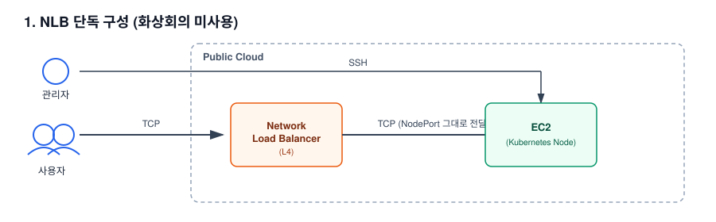
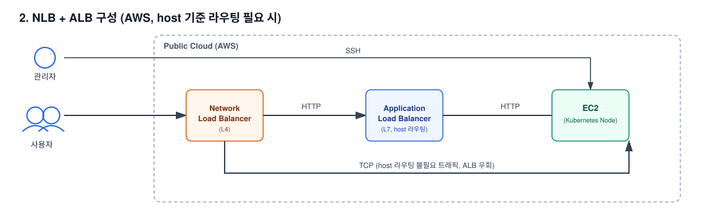
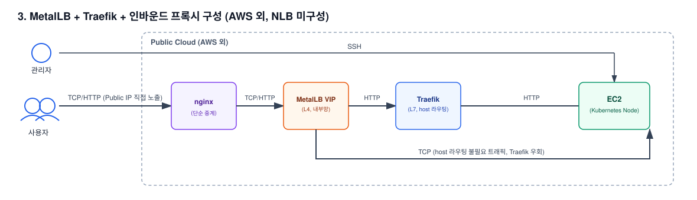

# 온프레미스 솔루션의 퍼블릭 클라우드 공통 아키텍처 설계

## 1. 배경

### 가. 요구사항

1) 온프레미스(native Kubernetes 구축)로만 제공되던 솔루션을, 퍼블릭 클라우드 환경에서도
   구축할 수 있도록 로드밸런서·서버·방화벽 요구사항과 아키텍처를 정리해야 했음
2) NLB + ALB 조합이 로드밸런싱 구성의 best practice이지만, NLB의 타겟 그룹으로 ALB를
   등록해 L4와 L7을 하나의 진입점으로 묶는 기능 자체가 AWS Elastic Load Balancing 고유
   기능이라 다른 퍼블릭 클라우드(GCP, Azure 등)에는 동일하게 적용할 수 없음 — 특정
   클라우드에 종속되지 않고 어디에서나 동일한 서비스 범위(HTTP 기반 서비스인 웹/화상회의,
   그 외 TCP 기반 서비스)를 제공할 수 있는 **공통 아키텍처**가 필요했음
3) 고객사마다 클라우드 종류와 화상회의 서비스 사용 여부가 달라, 상황별로 선택 가능한 표준
   구성안을 마련하는 방향으로 설계

## 2. 기대효과

### 가. 클라우드 종속 없는 표준 구성 확보

1) 클라우드 종류·화상회의 사용 여부에 따라 선택 가능한 3가지 표준 구성안을 마련해, 특정
   클라우드에 종속되지 않고 이식 가능한 로드밸런싱 아키텍처를 확보

### 나. 기존 자산 재사용을 통한 설계 효율화

1) NLB가 ALB 또는 MetalLB VIP를 타겟으로 잡을 수 없는 AWS 외 클라우드의 제약을, 신규
   컴포넌트를 새로 설계하지 않고 온프레미스에서 이미 검증해둔 인바운드 프록시 및
   MetalLB+Traefik 조합을 재사용해 해결

### 다. 실제 구축 가능한 수준의 아키텍처 확보

1) Client IP 보존, SSL 종단 분리, AWS 클라우드 특유의 네트워킹 요건(Source/Destination
   Check)까지 포함해, 문서만이 아니라 실제 구축까지 이어질 수 있는 아키텍처로 설계

### 라. 구성 옵션 비교

| 클라우드 | 화상회의 사용 | 선택 옵션 | L7 라우팅 담당 |
|---|---|---|---|
| 무관 | 미사용 | 옵션 1 — NLB 단독 | 없음 (L4만) |
| AWS | 사용 | 옵션 2 — NLB + ALB (best practice) | ALB |
| AWS 외 | 사용 | 옵션 3 — MetalLB + Traefik + 인바운드 프록시 | Traefik |

## 3. 구성도

### 가. 옵션 1 — NLB 단독 구성 (화상회의 미사용)

- client IP 보존 필요 (NLB : Proxy Protocol 설정 필수)
- NLB: s-nat(NAT Loopback) 설정 및 SSL 인증서 등록, SSL Offloading 설정
- ALB 미구성으로 HTTP → HTTPS 리다이렉트 불가 (웹 브라우저 URL 입력 시 `https://` 직접 입력 필요)

### 나. 옵션 2 — NLB + ALB 구성 (AWS, best practice)

- client IP 보존 필요 (NLB : Proxy Protocol, ALB : X-Forwarded-For 설정 필수)
- NLB: s-nat(NAT Loopback) 설정. host 기준 라우팅이 필요한 HTTP 포트(웹/화상회의)는 ALB로
  전달(SSL Pass-through), 그 외 TCP 기반 포트는 서버로 직접 전달
- ALB: SSL 인증서 등록 및 SSL Offloading, HTTP → HTTPS 리다이렉트, host-based routing 설정
- 다만 이 구성은 NLB가 ALB를 타겟 그룹으로 직접 등록하는 AWS 전용 기능에 기반하므로, AWS
  환경에서만 적용 가능

### 다. 옵션 3 — MetalLB + Traefik + 인바운드 프록시 구성 (AWS 외, NLB 미구성)

MetalLB의 floating VIP를 타겟으로 잡는 기능이 AWS 외 클라우드의 NLB 타겟 설정 UI에서는
지원되지 않아(MSP 정책이 아닌 플랫폼 자체 제약), 이 옵션은 NLB 자체를 구성하지 않고 nginx
인바운드 프록시가 Public IP를 직접 수신해 MetalLB VIP로 단순 중계하며, 실제 host 기준
라우팅은 온프레미스와 동일하게 Traefik이 담당하도록 구성했습니다.

- client IP 보존: nginx는 단순 중계만 하므로 원본 헤더를 그대로 전달, Traefik이 X-Forwarded-For로
  최종 보존
- nginx: host 기준 라우팅이 필요한 HTTP 포트(웹/화상회의)와 그 외 TCP 기반 포트 모두 동일하게
  MetalLB VIP로 전달만 하고, 실제 분기는 뒤단 Traefik이 담당
- Traefik: SSL 인증서 등록 및 SSL Offloading, HTTP → HTTPS 리다이렉트, host-based routing 설정
  (온프레미스와 동일)

## 4. 성과

1) 클라우드 종류와 화상회의 사용 여부에 따라 선택 가능한 3가지 표준 구성안을 마련해, 특정
   클라우드에 종속되지 않고 이식 가능한 로드밸런싱 아키텍처를 제공
2) AWS 전용 기능(NLB→ALB 타겟팅)과 플랫폼 제약(NLB의 VIP 타겟 미지원)을, 신규 클라우드별
   로드밸런서를 개별 조사하는 대신 기존에 다른 목적으로 설계해둔 온프레미스 구성 요소를
   재사용해 해결 — 설계 리소스를 절감하면서 검증된 구성 요소를 재활용
3) 클라이언트 IP 보존, SSL 종단 분리, AWS 특유의 CNI 네트워킹 요건까지 포함한 실제 구축
   가능한 수준의 아키텍처 문서로 정리

---

## 상세 문서

방화벽 세부 정책(포트/도메인 단위), 서버 디스크/볼륨 구성 기준 등을 포함한 상세 문서는
비공개 리포지토리에 별도 보관 중입니다. 필요 시 요청해주시면 공유드리겠습니다.
