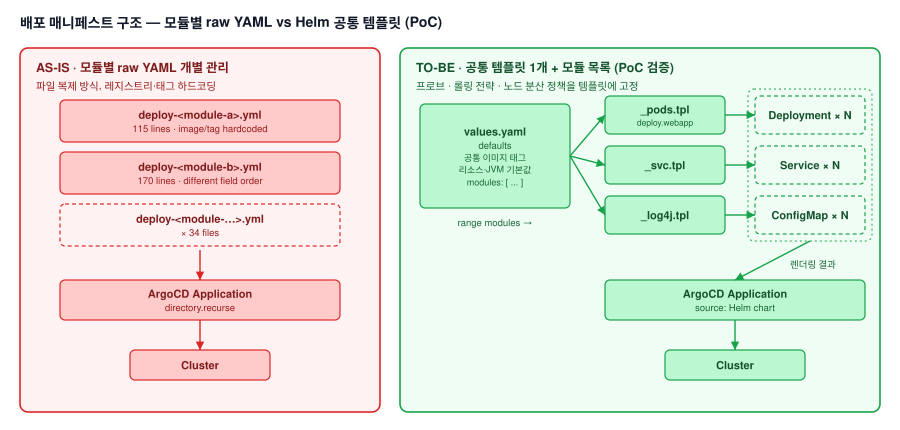

# 애플리케이션 배포 매니페스트 표준화 PoC — Helm 공통 템플릿 전환 검증

## 1. 배경 및 문제 정의

### 가. 현행 배포 구조 (AS-IS)
1) WAS 업무 모듈마다 개별 raw Deployment YAML을 유지하며, ArgoCD가 디렉터리 전체를 동기화하는 구조 (모듈별 34개 파일 관리)

### 나. 한계점
1) **관리 오버헤드**: 신규 모듈 추가 시 기존 매니페스트를 복사하는 방식이라 템플릿 구성, 필드 순서, 롤링 업데이트 전략, ServiceAccount 등 설정 불일치(drift) 누적
2) **버전 갱신 비효율**: 레지스트리와 이미지 태그가 34개 파일에 각각 하드코딩되어, 릴리즈마다 모든 파일을 개별 수정
3) **표준 부재**: 리소스(requests/limits)와 JVM 힙 설정이 모듈마다 임의로 지정되어 있고, 공통 기본값과 산정 기준 부재

## 2. 목표 및 기대효과

### 가. 운영 효율 개선
1) 파일 복사·수정 방식에서 벗어나, values.yaml 모듈 목록에 항목을 추가하는 선언적 구조로 전환
2) 이미지 버전을 공통 태그 한 곳에서 일괄 변경

### 나. 설정 일관성 확보
1) 프로브(liveness/readiness), 롤링 업데이트 전략, 노드 분산 정책을 템플릿 레벨에 고정해 설정 drift를 구조적으로 차단

### 다. 리소스 표준화
1) 공통 기본값(fallback)을 적용하고, 모듈별 산정 근거를 values.yaml에서 중앙 관리

### 라. AS-IS / TO-BE 비교

| 구분 | AS-IS | TO-BE |
|---|---|---|
| 매니페스트 구성 | 모듈별 raw YAML 34개 개별 관리 | 공통 템플릿 1개 + 모듈 목록(values.yaml) |
| 신규 모듈 추가 | 기존 파일 복제 후 수동 수정 | values.yaml에 모듈 정의 1건 추가 |
| 이미지/버전 갱신 | 34개 파일 전수 수정 | values.yaml 공통 태그 한 줄 수정 |
| 공통 정책 관리 | 파일별 설정 상이 (drift 발생) | 템플릿에 공통 정책(프로브, 전략 등) 고정 |
| 리소스/JVM 설정 | 모듈별 임의 값, 기본값 부재 | 공통 기본값 fallback + 산정 기준 중앙화 |

## 3. 변경 토폴로지 (Topology)



### 가. AS-IS

```
webapps/deploy/
├── deploy-<module-a>.yml   (115 lines, image/tag hardcoded)
├── deploy-<module-b>.yml   (170 lines, different field order)
└── ... x34
        │
        ▼
ArgoCD Application (directory.recurse) ──▶ Cluster
```

### 나. TO-BE

```
values.yaml (defaults + module list)
        │
        ▼
_pods.tpl  "deploy.webapp"  ── range modules ──▶ Deployment x N
_svc.tpl / _log4j.tpl       ── range modules ──▶ Service / ConfigMap
        │
        ▼
ArgoCD Application (Helm) ──▶ Cluster
```

## 4. PoC 결과 및 회고

### 가. 검증 결과
1) 파일럿 모듈을 선정해 `helm template` 렌더링 결과를 기존 raw 매니페스트와 diff로 대조하고, 클러스터에 배포해 동작까지 확인
2) 기존 raw 매니페스트 기반 배포 파이프라인으로 운영 중인 다수 고객사 환경의 마이그레이션 공수와 업데이트 로직 변경 리스크를 감안해, 운영 전면 적용은 보류하고 PoC로 마무리

### 나. 회고 및 향후 제언
1) 템플릿 일원화는 유지보수 비용을 크게 낮추지만, 이미 고객사 환경·기존 파이프라인과 결합된 구조에서는 한 번에 전환(Big Bang)하기 어렵다는 점을 확인
2) 다시 진행한다면 전면 전환 대신 신규 모듈부터 Helm 템플릿을 우선 적용하거나, 기존 raw 매니페스트를 유지한 채 단계적 오버레이가 가능한 Kustomize를 점진적 마이그레이션 브릿지로 검토하는 방식을 택할 것

## 5. 역할

1) PoC 기획, Helm 공통 차트 구조 설계, 템플릿 구현, 렌더링·배포 검증 전 과정 단독 수행
2) 모듈별 리소스 및 JVM 힙 산정 기준 수립만 팀원과 협업
