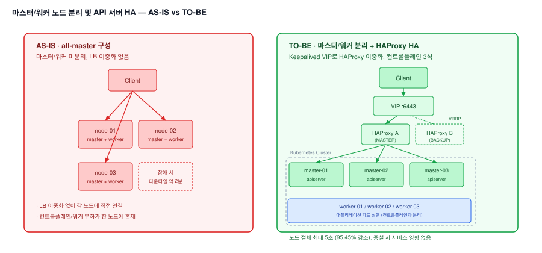

# 사내 SaaS 제품 고가용성 환경 구성 — 마스터/워커 노드 분리 및 API 서버 HA 구축

## 1. 배경

### 가. AS-IS

1) 마스터/워커 노드가 분리되지 않은 all-master 구성으로 운영
2) 마스터 노드 장애 발생 시 다운타임 약 2분 — 컨트롤플레인/워커 부하 분리와 다운타임 단축이 필요

### 나. 목적

1) Kubernetes 마스터/워커 노드 분리 구성
2) HAProxy + Keepalived를 이용한 Kubernetes API 서버 고가용성 환경 구축
3) 마스터 노드 장애 시 다운타임 감소 (2분 → 30초 목표)

## 2. 기대효과

### 가. 컨트롤플레인 장애 격리

1) 워커 부하와 분리된 3식 컨트롤플레인 구성으로, 특정 노드 장애가 워커 서비스로 전이되지 않도록 격리

### 나. 무중단에 가까운 API 서버 절체

1) HAProxy 이중화(Keepalived VIP)로 컨트롤플레인 절체 시간을 초 단위로 단축해, 클러스터 확장·유지보수 작업의 안전 마진을 확보

### 다. AS-IS / TO-BE 비교

| 항목 | AS-IS | TO-BE |
|---|---|---|
| 노드 구성 | all-master (마스터/워커 미분리) | 마스터 3식 / 워커 3식 분리 |
| API 서버 접근 경로 | 단일 경로, LB 이중화 없음 | HAProxy 이중화(Keepalived VIP)로 접근 |
| 컨트롤플레인 절체 시간 | 최대 110초 | 최대 5초 (95.45% 감소) |
| 노드 증설 영향 | 미검증 | 컨트롤플레인/워커 증설 시 서비스 영향 없음 검증 완료 |

## 3. 구성도



```
STEP 1  AS-IS 진단 — all-master 구성에서 마스터 장애 시 다운타임 약 2분 확인
  │
  ▼
STEP 2  마스터/워커 노드 분리 — 마스터 3식 / 워커 3식으로 클러스터 재구성
  │
  ▼
STEP 3  API 서버 HA 구축 — HAProxy로 3대 컨트롤플레인 앞단 로드밸런싱,
        Keepalived로 HAProxy 이중화(VIP) 구성
  │
  ▼
STEP 4  검증 — 컨트롤플레인 절체 시험(최대 5초), 노드 증설 시험(서비스 영향 없음) 진행
  │
  ▼
STEP 5  쿠버네티스 버전 업그레이드 — 이 HA 구성 위에서 단계별 버전 업그레이드 및
        서비스 영향도 검증(업그레이드 전 StatefulSet 스케일 감소 필요성 도출)
```

## 4. 성과

1) all-master 구성을 마스터/워커 3식씩 분리하고 HAProxy+Keepalived 기반 API 서버 HA를 구축해, 컨트롤플레인 장애 시 다운타임을 2분대에서 최대 5초 수준(95.45% 감소)까지 단축
2) 컨트롤플레인·워커 노드 증설이 서비스 영향 없이 가능함을 시험으로 검증해 이후 확장 작업의 안전성 근거를 확보
3) 이 HA 구성 위에서 이후 발생한 kube-apiserver advertise-address 오설정 인시던트의 조사·조치 기반이 됨

---

## 상세 문서

구성 시 사용한 HAProxy/Keepalived 설정 전문, 절체·증설 시험 상세 수치는 비공개 리포지토리에 별도 보관 중입니다. 필요 시 요청해주시면 공유드리겠습니다.
