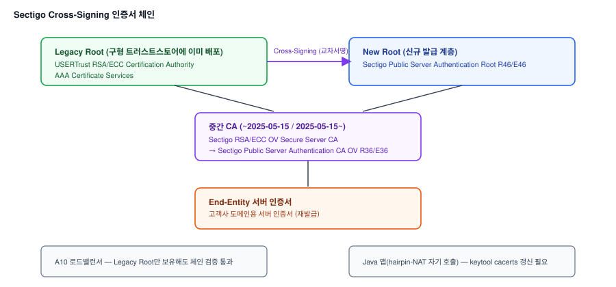

# 글로벌 CA Root 전환에 따른 PKI 인증오류 대응 (Cross-Signing 인증서 적용)

## 1. 배경

### 가. 증상

1) 공공기관 고객사 SSL 인증서 재발급 후 A10 로드밸런서에 적용 시, 뒤에 있는 Java
   애플리케이션(K8s 컨테이너로 배포)에서 PKI 인증오류가 발생
2) 동일한 패턴의 이슈가 두 차례 반복 발생 — 2025년 3분기(Sectigo 발급 인증서),
   2026년 9월(GoDaddy 발급 인증서)

## 2. 원인분석 요약

1) 두 CA 모두 Root CA를 신규 계층으로 전환하면서, A10 로드밸런서가 아직 신규 Root를
   트러스트스토어에 반영하지 못해 체인 검증에 실패
2) 해당 Java 앱은 API 통신을 위해 자기 자신의 도메인을 다시 호출하는 hairpin-NAT
   구조로 동작해, Java 앱 자신도 "클라이언트"로서 도메인 인증서를 검증해야 하는 구조 —
   구버전 Java의 CA 번들이 오래되어 Java 측에서도 동일한 검증 실패가 발생



- CA는 신규 Root로 전환하면서도, 오래된 Root일수록 더 널리 배포돼 있다는 점을 활용해
  신규 Root를 레거시 Root로 교차서명(Cross-Signing)한 인증서를 함께 제공 — A10처럼 신규
  Root 반영이 늦은 장비도 이 교차서명 인증서로는 체인 검증을 통과할 수 있음

## 3. AS-IS / TO-BE 비교

| 항목 | AS-IS | TO-BE |
|---|---|---|
| 인증서 발급 방식 | CA가 발급한 신규 Root 단일 체인 인증서 | 레거시 Root(USERTrust 등)로 교차서명된 Cross-Signing 인증서로 재발급 |
| A10 로드밸런서 | 신규 Root 미보유로 체인 검증 실패 | Cross-Signing 인증서로 기존 트러스트스토어 상태에서도 검증 통과 |
| Java 앱(hairpin-NAT 자기 호출) | 구버전 CA 번들로 자체 도메인 인증서 검증 실패 | 최신 Java 버전으로 업데이트해 최신 CA 번들 확보, keytool cacerts 정비 |
| 재발 대응 | 발생 시점에 개별 대응 | CA 공식 Root 전환 공지를 인증서 점검 절차에 포함해 사전 확인 |

## 4. 조치 흐름

```
STEP 1  재발급된 인증서의 Root CA 확인 → A10 미지원 Root(R46, R1 등) 식별
  │
  ▼
STEP 2  Cross-Signing 구조 확인 → 레거시 Root(USERTrust, G2 Root 등)로 교차서명된
        인증서 존재 여부 파악
  │
  ▼
STEP 3  고객사/CA에 Cross-Signing 인증서로 재발급 요청 및 재전달 안내
  │
  ▼
STEP 4  Java 앱의 hairpin-NAT 자기 호출 구조로 인한 자체 인증서 검증 필요성 확인 →
        팀원과 협업해 keytool cacerts 점검, 최신 Java 버전으로 업데이트
  │
  ▼
STEP 5  CA Root 전환이 반복되는 흐름을 근거로, 인증서 점검 시 CA 공식 Root 변경 공지를
        함께 확인하는 절차를 팀에 안내
```

## 5. 성과

1) A10과 Java 앱 양쪽 모두 재발급 없이 Cross-Signing 인증서 적용만으로 신속하게 서비스
   정상화
2) Java 버전 업데이트로 CA 번들을 최신화해, 향후 유사한 Root 전환 발생 시에도 별도
   조치 없이 대응 가능한 구조로 개선
3) 반복되는 CA Root 전환 흐름을 팀에 공유해, 사후 대응이 아닌 사전 점검 절차로 전환

---

## 상세 문서

원인 진단 과정, Cross-Signing 체인 상세, 팀원과의 역할 분담 등 세부 내용을 포함한 상세
문서는 비공개 리포지토리에 별도 보관 중입니다. 필요 시 요청해주시면 공유드리겠습니다.
