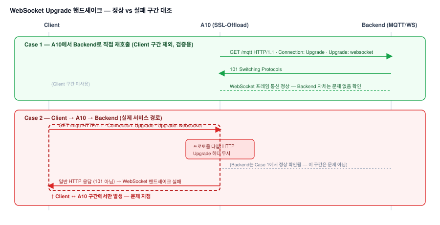

# SSL-Offload 이후 WSS 프로토콜 HTTP 강제 변환 대응

## 1. 배경

### 가. 증상

1) MQTT 통신용 포트(18085)에 대해 필수스펙가이드에서 로드밸런서 정책 내 wss 프로토콜
   정의를 제거하려던 상황에서, 고객사가 "SSL-Offload이므로 HTTP로 프로토콜을 강제
   변환해서 줘야 하는지"를 문의
2) 실제로는 SSL-Offload 이후에도 WSS(WebSocket over TLS) 프로토콜로 통신돼야 하는
   구간인데, 프로토콜이 HTTP로 고정 처리되어 웹소켓 통신 자체가 되지 않는 상황이었음

## 2. 원인분석 요약

1) WebSocket은 일반 HTTP GET 요청에서 `Connection: Upgrade` / `Upgrade: websocket`
   헤더로 프로토콜 전환을 요청하고, 서버가 `101 Switching Protocols`로 응답하면 동일
   TCP 커넥션 위에서 WebSocket 프레임 통신으로 전환되는 구조
2) A10이 SSL-Offload 이후 뒤쪽 트래픽을 처리할 프로토콜 타입을 "HTTP"로 고정해두고
   있어, Upgrade 헤더와 101 응답을 일반 HTTP로 처리해버려 핸드셰이크가 성립하지 않았음
3) Postman으로 "A10 경유 vs 백엔드 직접 호출"을 대조 테스트해 A10 경유 시에만 101 대신
   HTTP 응답이 오는 것을 확인, 원인을 A10 프로토콜 설정으로 특정

## 3. AS-IS / TO-BE 비교

| 항목 | AS-IS | TO-BE |
|---|---|---|
| A10 포트 프로토콜 타입 | HTTP로 고정 | SSL-Offload 이후에도 WSS Upgrade가 통과되도록 재설정 |
| Upgrade 핸드셰이크 | `101 Switching Protocols` 대신 일반 HTTP 응답으로 처리되어 실패 | 정상적으로 101 응답 전달, WebSocket 연결 성립 |
| 원인 진단 방식 | 감으로 프로토콜 강제 변환 여부 판단 | Postman으로 A10 경유/우회 직접 호출을 대조해 원인 지점 특정 |
| 스펙 가이드 | wss 프로토콜 정의 제거 방향으로 검토 중 | SSL-Offload와 WebSocket Upgrade가 함께 필요한 포트임을 반영해 유지 |

## 4. 성과

1) Postman 기반 대조 테스트로 원인을 A10 프로토콜 설정으로 명확히 특정해, 불필요한
   스펙 가이드 변경(wss 프로토콜 정의 제거)을 막고 정확한 재설정 요청으로 해결
2) SSL-Offload 환경에서도 WebSocket Upgrade가 필요한 포트를 식별하는 기준을 팀에 공유

---

## 상세 문서

원인 진단 과정과 Postman 검증 상세는 비공개 리포지토리에 별도 보관 중입니다. 필요 시
요청해주시면 공유드리겠습니다.
