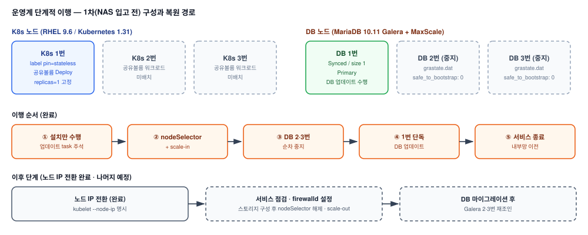

# 공공기관 AI 그룹웨어 개발계·운영계 구축 (진행 중)

> 현재 진행 중인 프로젝트로, 운영계 1차 이행까지 완료된 시점 기준으로 작성함.

## 1. 배경

### 가. 프로젝트 개요

1) 국가중요시설로 지정된 공공기관 고객사에 AI 그룹웨어 솔루션을 개발계·운영계로 신규 구축하는 프로젝트
2) K8s 노드 3식(RHEL 9.6, Kubernetes 1.31) + DB 노드 3식(MariaDB Galera + MaxScale) 구성
3) HCI 리소스 제약, 웹 프록시 경유 외부 통신, 보안장비 정책 등 제약이 많은 폐쇄망 환경

### 나. 본인 역할

1) 인프라 구축·이행의 기술 영역 전체를 단독 수행
2) PM은 문서 작업과 본인이 요청한 사항의 고객사 협의를, 협력사는 고객사와의 중간 창구를 담당
3) 운영계 단계적 이행 방식은 고객사 요구사항(장비 입고·서비스 일정)에 맞춰 본인이 직접 설계

## 2. 기대효과

### 가. 장비 미입고 상황에서도 일정 준수

1) 공유 볼륨용 NAS 장비가 입고되기 전에도 운영계 설치·DB 업데이트를 먼저 완료해, 내부망 이전 일정에 맞춤

### 나. 되돌리기 쉬운 이행 구조

1) Galera를 해체하지 않고 노드만 중지하고, 워크로드도 nodeSelector·replicas만 조정 — 장비 입고 후 재조인·scale-out만으로 원래 3노드 구성으로 복원 가능

### 다. 운영계 1차 이행 AS-IS / TO-BE

| 항목 | 표준 구성 | 1차 이행 구성 (NAS 입고 전) |
|---|---|---|
| 공유 볼륨 워크로드 | 3노드 분산 | 1번 노드 nodeSelector 고정, replicas=1 |
| DB 클러스터 | Galera 3노드 Synced | 1번 노드 단독 Primary, 2·3번 중지(`safe_to_bootstrap: 0`) |
| 설치/업데이트 | 한 번에 수행 | 설치 → 단독 기동 확인 → DB 업데이트로 분리 |
| 복원 경로 | - | NAS 입고 후 scale-out, 마이그레이션 후 Galera 재조인 |

## 3. 구성도

## 4. 진행 현황 및 성과

### 가. 완료

1) 개발계 구축: HCI 리소스 부족을 메모리 증설(48G → 64G)과 리소스 최적화(미사용 모듈 제거, DB·ES 리소스 절반 조정)로 해결
2) 개발계 이슈 대응: 웹 프록시 경유 아웃바운드 통신 불가, 보안장비 정책으로 인한 사용자 PC 접근 불가를 원인 특정 후 고객사와 조율해 해결
3) 유지보수: 강제 재기동 후 라우팅 테이블 생성 오류로 인한 접속 불가를 원인 분석 후 복구
4) 운영계 1차 이행: 단계적 이행 설계로 설치·DB 업데이트 완료 후 내부망 이전

### 나. 예정

1) K8s 노드 IP 변경 및 OS 방화벽(firewalld, ipset 기반 zone 분리) 설정
2) NAS 장비 입고 후 Deployment scale-out
3) DB 마이그레이션 이후 Galera 클러스터 DB 노드 재조인

---

## 상세 문서

이슈별 상세 원인·조치 내역과 이행 절차, 방화벽 설계 상세는 비공개 리포지토리에 별도 보관 중입니다.
필요 시 요청해주시면 공유드리겠습니다.
