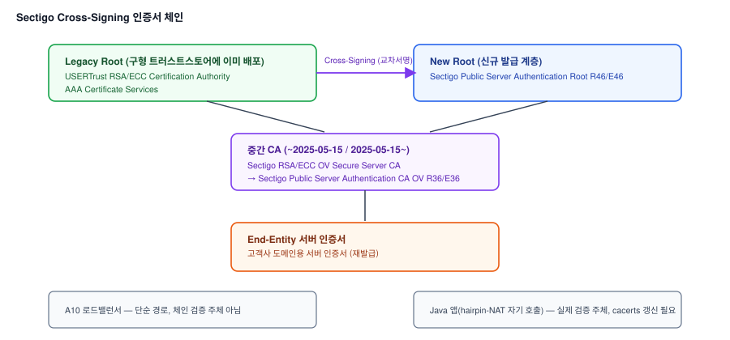

# 글로벌 CA Root 전환에 따른 PKI 인증오류 대응 (Cross-Signing 인증서 적용)

## 1. 배경

### 가. 증상

1) 고객사 SSL 인증서 재발급 후 A10 로드밸런서에 적용 시, 뒤에 있는 Java
   애플리케이션(K8s 컨테이너로 배포)에서 PKI 인증오류가 발생
2) 동일한 패턴의 이슈가 두 차례 반복 발생 — 2025년 3분기(Sectigo 발급 인증서),
   2026년 9월(GoDaddy 발급 인증서)

## 2. 원인분석 요약

1) A10은 단순 로드밸런서/백엔드 경로일 뿐, 실제 인증서 체인 검증 실패는 뒤에 있는
   **Java 앱 자신**에서 발생 — 해당 Java 앱은 API 통신을 위해 자기 자신의 도메인을 다시
   호출하는 hairpin-NAT 구조로 동작해, Java 앱이 "클라이언트"로서 자기 도메인의 인증서를
   검증해야 하는 구조였음
2) 구버전 Java의 CA 번들이 두 CA의 신규 Root를 인식하지 못해 검증 실패 — 단, 신뢰 반영
   범위는 사례마다 달랐음: Sectigo 건은 해당 Root가 오래전부터 널리 반영돼 일반 브라우저는
   정상이었고 Java만 실패, GoDaddy 건은 전환 시점이 최근이라 Chrome 브라우저 자체도 아직
   신규 Root를 반영하지 못해 함께 실패



- CA는 신규 Root로 전환하면서도, 오래된 Root일수록 더 널리 배포돼 있다는 점을 활용해
  신규 Root를 레거시 Root로 교차서명(Cross-Signing)한 인증서를 함께 제공 — Java 버전을
  상시 최신으로 유지하기 어려운 실무 제약이 있는 환경에서도, 이 교차서명 인증서로는
  Java 업데이트 없이 검증을 통과할 수 있음

## 3. AS-IS / TO-BE 비교

| 항목 | AS-IS | TO-BE |
|---|---|---|
| 인증서 발급 방식 | CA가 발급한 신규 Root 단일 체인 인증서 | 레거시 Root(USERTrust 등)로 교차서명된 Cross-Signing 인증서로 재발급 |
| Java 앱(hairpin-NAT 자기 호출) | 구버전 CA 번들로 자체 도메인 인증서 검증 실패 | Cross-Signing 인증서로 즉시 정상화, 이후 최신 Java 버전으로 업데이트해 CA 번들·keytool cacerts 정비 |
| 재발 대응 | 발생 시점에 개별 대응 | CA 공식 Root 전환 공지를 인증서 점검 절차에 포함해 사전 확인 |

## 4. 조치 흐름

```
STEP 1  재발급된 인증서의 Root CA 확인 → A10 미지원 Root(R46, R1 등) 식별
  │
  ▼
STEP 2  실제 검증 실패 지점이 A10이 아닌 Java 앱(hairpin-NAT 자기 호출) 자체임을 파악
  │
  ▼
STEP 3  Cross-Signing 구조 확인 → 레거시 Root(USERTrust, G2 Root 등)로 교차서명된
        인증서 존재 여부 파악, 고객사/CA에 재발급 요청
  │
  ▼
STEP 4  Java 버전을 상시 최신으로 유지하기 어려운 제약을 고려해, 팀원과 협업해 keytool
        cacerts 점검 및 최신 Java 버전으로 업데이트
  │
  ▼
STEP 5  CA Root 전환이 반복되는 흐름을 근거로, 인증서 점검 시 CA 공식 Root 변경 공지를
        함께 확인하는 절차를 팀에 안내
```

## 5. 성과

1) 원인을 Java 앱의 hairpin-NAT 자기 호출 구조까지 정확히 좁혀, Cross-Signing 인증서
   적용만으로 신속하게 서비스 정상화
2) Java 버전 업데이트로 CA 번들을 최신화해, 향후 유사한 Root 전환 발생 시에도 별도
   조치 없이 대응 가능한 구조로 개선
3) 반복되는 CA Root 전환 흐름을 팀에 공유해, 사후 대응이 아닌 사전 점검 절차로 전환

---

## 상세 문서

원인 진단 과정, Cross-Signing 체인 상세, 팀원과의 역할 분담 등 세부 내용을 포함한 상세
문서는 비공개 리포지토리에 별도 보관 중입니다. 필요 시 요청해주시면 공유드리겠습니다.
