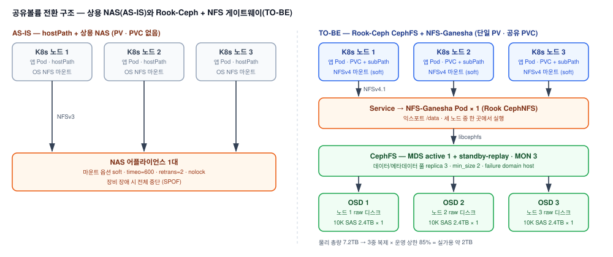

# 상용 NAS → Rook-Ceph(CephFS) 공유볼륨 전환 PoC (진행 중)

> 현재 진행 중인 PoC로, 공유볼륨 구축까지 완료하고 성능 검증(fio)을 진행 중인 시점 기준으로 작성함.

## 1. 배경

### 가. PoC 개요

1) 구축형(온프레미스) 솔루션의 공유볼륨을 상용 NAS 어플라이언스로 제공해 왔으나, 증설 요구가 계속되면서 벤더 종속과 장비 단가 상승으로 인프라 투자 비용 부담이 커짐
2) 공유볼륨을 노드 로컬 디스크 기반의 Rook-Ceph(CephFS)로 전환할 수 있는지, 전환 시의 trade-off(성능 저하, 실효 용량 감소, 운영 복잡도)가 수용 가능한 수준인지 검증하는 PoC
3) 사내 검증 클러스터 3노드에서의 기술 검증까지가 범위

### 나. 본인 역할

1) 영향도 점검, 기획서·아키텍처 설계서 작성, 클러스터 및 Rook-Ceph 구축, 검증 시나리오 수립, 테스트 수행까지 PoC 전 과정을 단독 수행
2) 애플리케이션의 스토리지 장애 반응은 점검 항목을 설계해 개발팀에 질의하고, 회신을 취합·분석해 설계 근거로 사용

## 2. 기대효과

### 가. 스토리지 비용 구조 개선

1) 고가의 NAS 장비 대신 서버 로컬 디스크 구입으로 도입·증설 비용 절감, 벤더 종속 해소

### 나. 단일 장애점 해소

1) NAS 1대 장애 시 전체가 중단되던 구조에서, 노드·디스크 1대 장애에도 I/O가 지속되는 구조로 전환

### 다. 근거 있는 도입 판단

1) 61개 검증 항목과 측정 전에 확정한 합격 기준으로 도입 가능 여부를 판정 — 유실 0건, 장애 시 중단 시간 한도 이내, 기준 NAS 측정값 대비 처리량 80% 이상

### 라. AS-IS / TO-BE 비교

| 항목 | AS-IS (상용 NAS) | TO-BE (Rook-Ceph) |
|---|---|---|
| 도입·증설 | NAS 장비 단위 구입 | 서버 로컬 디스크 추가 |
| 가용성 | NAS 1대 장애 시 전체 중단 | 노드·디스크 1대 장애에도 I/O 지속 (replica 3 / min_size 2) |
| 가용 용량 | NAS 실용량 | 원디스크의 약 28% (3중 복제 × 운영 상한 85%) |
| 관리 포인트 | NFS 클라이언트 1종 | MON·MGR·OSD·MDS·CSI 5종, 운영 주체가 자사로 변경 |
| 앱 연결 | hostPath + OS NFS 마운트 | 단일 PV · 공유 PVC + subPath, NFSv4 마운트 |
| 백업 | 파일시스템 기반 백업 | CephFS 스냅샷 지원 제품 필요 |

## 3. 구성도

1) 애플리케이션 16개 모듈을 사전 점검한 결과 앱 레벨 I/O 타임아웃을 둔 모듈이 없어, 스토리지 무응답 시 프로세스가 무한 대기에 빠지지 않으려면 현행 NFS의 `soft` 타임아웃 제어를 유지해야 했음
2) CephFS를 직접 마운트하는 방식은 이 타임아웃 제어가 없어 기각하고, CephFS 앞단에 NFS-Ganesha 게이트웨이(Rook CephNFS)를 두는 방식으로 확정
3) 게이트웨이는 Rook 권장에 따라 단일 구성이며, 게이트웨이 재시작·노드 장애 시의 중단 시간을 핵심 검증 항목으로 설정

## 4. 진행 현황

### 가. 완료

1) 영향도 점검: 서비스 모듈별 파일 I/O 패턴 전수 조사 (파일 잠금 사용 여부, 쓰기 실패 처리, I/O 타임아웃)
2) 기획서 및 아키텍처 설계서 작성: 제공 방식 비교, 3노드 Ceph 클러스터 설계, 마운트 옵션 확정
3) Kubernetes 클러스터 및 Rook-Ceph 공유볼륨 구축

### 나. 진행 중

1) fio 기반 파일 I/O 성능 테스트 — 기준 NAS에서 측정한 것과 같은 시험을 재현해 비교

### 다. 예정

1) 데이터 정합성 및 failover 검증 (OSD·MDS·노드·게이트웨이 장애)
2) Grafana k6 기반 웹 부하 테스트
3) 데이터 백업·복원 테스트
4) 결과 보고 및 도입 가능 여부 판정

---

## 상세 문서

제공 방식 비교 근거, 마운트 옵션별 결정 사유, 61개 검증 항목과 장애별 예상 중단 시간 산식, 성능 합격 기준 상세는 비공개 리포지토리에 별도 보관 중입니다.
필요 시 요청해주시면 공유드리겠습니다.
